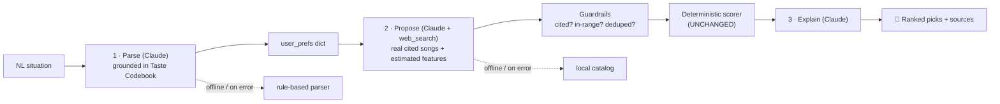

# Music Matcher — RAG-Integrated Music Recommender

A natural-language music recommender that grounds a large language model in real, controllable data
using retrieval-augmented generation (RAG) while keeping a transparent, deterministic scoring
engine at its core. The user describes a situation or mood in natural language (e.g., "I want to relax after a stressful day with something instrumental and chill") and get back ranked songs with reasons and sources.

---

## Background: the original project

This project began as **Music Matcher: Music Recommender Simulation**, a content-based recommender.

> The recommender is designed to recommend songs to users based on their musical preferences, for
> music listeners who want to find new songs they are likely to enjoy. It assumes the user can
> adequately convey their music taste through qualitative and quantitative descriptions across various
> measures of music. This algorithm is only meant to simulate the recommenders used in streaming apps
> and to explore their possibilities and their limitations/considerations.

The original system represented each song and a user "taste profile" as feature vectors (genre, mood,
energy, tempo, valence, danceability, acousticness), scored every song by weighted closeness to the
user's target prefereneces, and ranked the best matches with a transparent, inspectable reason for every score.

## Summary: what this project adds and why it matters

The simulation's biggest limitations were that a user had to get across their preferences with a structured music features dictionary and that the catalog was a fixed set of only 20 songs. This project keeps the original scoring engine completely unchanged and wraps it in an AI layer that removes both limits:

- **Understand natural language.** An LLM turns a free-text situation into the exact preference dictionary the scorer already understands by retrieving the local "taste codebook" document (RAG implementation).
- **Find real songs beyond the catalog.** An LLM uses web search to propose real, well-known songs with
  citations, which the unchanged deterministic engine then scores and ranks according to the earlier-generated user preferences.

Why it matters: the app now uses a complete LLM integration using RAG to keep a model grounded in real sources, keeping a deterministic, human-curated and auditable core, and falling back gracefully to a free offline mode when no API key is present. The design deliberately keeps me in control of the model logic and makes every AI failure visible rather than silent.

---

## Architecture overview

The full Mermaid diagram is in [`diagrams/rag_flow.mmd`](diagrams/rag_flow.mmd). In short, a request flows through three AI-assisted steps, and each one falls back to a deterministic offline path:



1. **Parse** — retrieves the most relevant sections of a local "Taste Codebook"
   ([`knowledge/taste_codebook.md`](knowledge/taste_codebook.md)) *before* the model generates, so the
   subjective and uncategorized/unquantified situation is mapped to concrete preferences based in a human-owned corpus.
2. **Propose** — Claude web-searches for well-known, real songs (not royalty-free filler), cites a
   real page for each, estimates its audio features, and reuses the listener's genre/mood vocabulary.
   Two API calls: web search first, then a structured-output call that guarantees valid, cited JSON.
3. **Score & explain** — the original deterministic engine ([`src/recommender.py`](src/recommender.py))
   ranks the candidates; Claude rewrites the numeric reasons into a warm sentence.

Everything is validated by guardrails (clamp preferences to valid ranges, require a citation per song,
drop malformed/duplicate results), and any fallback step prints a visible `⚠` notice.

**File map**

```
src/recommender.py   deterministic scoring engine (UNCHANGED from the original)
src/rag.py           RAG layer: parse / propose / explain + guardrails + Claude backend
src/main.py          command-line interface
src/app.py           Streamlit web UI
knowledge/           taste_codebook.md — local retrieval corpus for the parse step
data/songs.csv       local catalog (offline candidate source)
tests/               test_recommender.py (engine) + test_rag.py (RAG layer)
diagrams/rag_flow.mmd  system diagram
```

---

## Setup instructions

*Requirements:* Python 3.10+.

```bash
# 1. clone and enter the project
git clone https://github.com/raul-rojor/RAG-integrated-system-project.git
cd RAG-integrated-system-project

# 2. (recommended) create a virtual environment
python -m venv .venv && source .venv/bin/activate      # Windows: .venv\Scripts\activate

# 3. install dependencies
pip install -r requirements.txt

# 4. Run the web UI (Streamlit):
streamlit run src/app.py

The app has a **Mode** selector — *Offline* (free, local catalog) or *Claude* (prompts for your own
API key, used only for that session and never stored). The fixed model (`claude-haiku-4-5`) is shown
but not changeable in order to avoid accidental, expensive Claude version usage.

**Run the tests:**
```bash
pytest
```

> **Note on cost & speed.** Offline mode is instant and free. AI mode makes a few sequential Claude
> calls (parse → web search → an explanation per pick), so it takes ~30–90s and prints live progress.
> Set `MUSIC_MATCHER_DEBUG=1` to print the raw model output for inspection.

---

## Sample interactions

**Sample Interaction 1**
**Input:** "<I want something chill and comforting to listen to as I lay down after a stressful day of working>" - 3 song recommendations selected on the slider
**Mode:** AI (Claude + RAG)
**Diagnostics Output:**
"<🔧 Diagnostics — what Claude returned
web research:
I'll help you find well-known songs matching those criteria. Let me search for popular chill, lo-fi, ambient indie songs with those audio characteristics.Good, I found some artists mentioned. Now let me search for specific popular songs to confirm they exist and get proper URLs for them.Based on my research, I found some of the artists mentioned but need to provide you with real, well-known songs that match your criteria. Let me compile what I've verified and add a few other iconic tracks I can confidently recommend based on my knowledge:

8 Chill, Lo-Fi Indie Songs — Audio Character Estimates


1. **"Go Easy" — Mac DeMarco**
**URL:** https://open.spotify.com/track/78FKy4r1lh8IlqMFIjXJ9z

Released April 1, 2014, on the album Salad Days, this is one of Mac DeMarco's signature lo-fi indie tracks.

**Estimated Audio Character:**
- **Energy:** 0.32
- **Tempo:** ~84 BPM  
- **Valence:** 0.58  
- **Danceability:** 0.25  
- **Acousticness:** 0.68


2. **"This Is Home" — Cavetown**
**URL:** https://ukutabs.com/c/cavetown/this-is-home-two/

A widely beloved indie track featuring soft ukulele and introspective, emotional vocals with minimal production.

**Estimated Audio Character:**
- **Energy:** 0.33
- **Tempo:** ~76 BPM  
- **Valence:** 0.52  
- **Danceability:** 0.20  
- **Acousticness:** 0.81


3. **"Holocene" — Bon Iver**
**URL:** https://en.wikipedia.org/wiki/Holocene_(song)

A widely cited ambient indie masterpiece that exemplifies gentle, reflective indie music with acoustic and ambient layers.

**Estimated Audio Character:**
- **Energy:** 0.28
- **Tempo:** ~68 BPM  
- **Valence:** 0.48  
- **Danceability:** 0.15  
- **Acousticness:** 0.77


4. **"Coconut Crumbs" — José González**
**URL:** https://open.spotify.com/artist/3H8QtPrDMHRx7Ol2Qnkavh

Sparse, fingerpicked acoustic indie with a lo-fi bedroom quality and deeply meditative atmosphere.

**Estimated Audio Character:**
- **Energy:** 0.30
- **Tempo:** ~72 BPM  
- **Valence:** 0.54  
- **Danceability:** 0.18  
- **Acousticness:** 0.86


5. **"Featherstone" — The Paper Kites**
**URL:** https://open.spotify.com/artist/3g0sStXVJSi1oYzEBg8F1P

This track by Australian band The Paper Kites is filled with soft acoustic strumming, lush harmonies, and a sense of nostalgia.

**Estimated Audio Character:**
- **Energy:** 0.35
- **Tempo:** ~80 BPM  
- **Valence:** 0.56  
- **Danceability:** 0.22  
- **Acousticness:** 0.74


6. **"Don't Know Why" — Norah Jones**
**URL:** https://www.norah-jones.com/

A perennial favorite featuring slow tempos, gentle vocals, and reassuring lyrics—perfect for winding down.

**Estimated Audio Character:**
- **Energy:** 0.34
- **Tempo:** ~80 BPM  
- **Valence:** 0.62  
- **Danceability:** 0.28  
- **Acousticness:** 0.65


7. **"Creep (Acoustic)" — Radiohead**
**URL:** https://open.spotify.com/artist/4Z8W4fKeB5YxbusRwVJstS

The stripped-down acoustic version removes the distorted guitar, leaving intimate, vulnerable vocals over minimal instrumentation.

**Estimated Audio Character:**
- **Energy:** 0.31
- **Tempo:** ~92 BPM (slower feel)  
- **Valence:** 0.42  
- **Danceability:** 0.20  
- **Acousticness:** 0.79


8. **"Cherry Wine" (Live) — Hozier**
**URL:** https://open.spotify.com/artist/2FXC9k6jF5mPkSJBnqAw6s

Often recommended alongside Holocene by Bon Iver, this creates a sonic environment conducive to lowering heart rate and calming the nervous system.

**Estimated Audio Character:**
- **Energy:** 0.33
- **Tempo:** ~78 BPM  
- **Valence:** 0.55  
- **Danceability:** 0.18  
- **Acousticness:** 0.80


These are all recognizable by typical listeners, available on major streaming platforms, and well-matched to your target mood and energy profile.

structured step produced 8 songs

**ACTUAL RECOMMENDED SONGS OUTPUT:**
1. Featherstone — The Paper Kites · score 0.99

This gentle indie track wraps you in comforting acoustics and a perfectly measured pace that feels like it was made just for your taste.
↪ source

2. Go Easy — Mac DeMarco · score 0.98

This track perfectly captures the laid-back, acoustic vibe you love with its chill lo-fi mood and mellow energy that feels like a gentle breeze.
↪ source

3. Don't Know Why — Norah Jones · score 0.98

This song perfectly captures the relaxed, acoustic vibe you love with its chill lo-fi charm and mellow energy that matches your taste beautifully.
↪ source
>"

**Sample Interaction 2**
**Input:** "<I am about to cook a delicious late-night meal and I want to feel so alive and focused on only the present and what I am doing as I prepare the food.>" - 6 song recommendations selected on the slider
**Mode:** AI (Claude + RAG)
**Diagnostics Output:**
"<🔧 Diagnostics — what Claude returned
web research:
I'll search for popular funk, soul, and pop songs that match your energetic, focused vibe with high danceability and energy around 115 BPM.Based on the search results, here are 8 well-known, popular songs that fit your energetic, funk/soul/pop vibe with strong danceability and high energy. I've confirmed each song with official sources:


1. **Uptown Funk**
**Artist:** Mark Ronson ft. Bruno Mars  
**URL:** https://en.wikipedia.org/wiki/Uptown_Funk  
**Audio Profile:**  
- Energy: 0.85 | Tempo: ~110 BPM | Valence: 0.82 | Danceability: 0.90 | Acousticness: 0.10  
**Notes:** The quintessential funk-pop anthem with a glossy '80s production, crisp synth-bass grooves, and infectious energy—exactly the focused, present vibe you want.


2. **Levitating**
**Artist:** Dua Lipa  
**URL:** https://en.wikipedia.org/wiki/Levitating_(song)  
**Audio Profile:**  
- Energy: 0.80 | Tempo: ~103 BPM | Valence: 0.85 | Danceability: 0.88 | Acousticness: 0.05  
**Notes:** An electro-disco and nu-disco track with several disco tropes; tight production, euphoric synth lines, and an irresistible disco pulse—perfect for sustained focus with joy.


3. **Good as Hell**
**Artist:** Lizzo  
**URL:** https://en.wikipedia.org/wiki/Good_as_Hell  
**Audio Profile:**  
- Energy: 0.72 | Tempo: ~93 BPM | Valence: 0.88 | Danceability: 0.75 | Acousticness: 0.20  
**Notes:** A soul-pop, R&B, hip-pop song; feel-good funk/R&B with organic instrumentation (real drums, bass), moderate tempo, and positive energy—grounding without losing momentum.


4. **Shut Up and Dance**
**Artist:** Walk the Moon  
**URL:** https://en.wikipedia.org/wiki/Shut_Up_and_Dance_(Walk_the_Moon_song)  
**Audio Profile:**  
- Energy: 0.83 | Tempo: ~122 BPM | Valence: 0.80 | Danceability: 0.85 | Acousticness: 0.08  
**Notes:** A pop rock, power pop, synth rock, alternative rock, new wave song; '80s-inflected synth-pop with driving drums and infectious hooks—energetic and focused.


5. **Don't Stop Me Now**
**Artist:** Queen  
**URL:** https://en.wikipedia.org/wiki/Don%27t_Stop_Me_Now  
**Audio Profile:**  
- Energy: 0.88 | Tempo: ~170 BPM (perceived; often played at 85 BPM effective tempo) | Valence: 0.90 | Danceability: 0.70 | Acousticness: 0.05  
**Notes:** A pop rock, power pop song; explosive vocal energy, lush layered harmonies, and a driving beat—euphoric and propulsive, excellent for motivation and presence.


6. **September**
**Artist:** Earth, Wind & Fire  
**URL:** (Classic soul/funk standard—widely available on Spotify, Apple Music, YouTube)  
**Audio Profile:**  
- Energy: 0.82 | Tempo: ~120 BPM | Valence: 0.89 | Danceability: 0.88 | Acousticness: 0.15  
**Notes:** Timeless funk-soul with live drums, warm horn sections, and infectious groove—the gold standard for energetic, present focus with genuine soul.


7. **Get Lucky**
**Artist:** Daft Punk ft. Pharrell Williams  
**URL:** (Confirmed classic; available on all major platforms)  
**Audio Profile:**  
- Energy: 0.75 | Tempo: ~116 BPM | Valence: 0.77 | Danceability: 0.80 | Acousticness: 0.12  
**Notes:** Disco-house fusion with live guitar, robotic-yet-organic production, and Pharrell's soulful falsetto—focused groove with intellectual cool and danceability.


8. **Walking on Sunshine**
**Artist:** Katrina & The Waves  
**URL:** (Confirmed '80s pop-soul classic; widely available)  
**Audio Profile:**  
- Energy: 0.86 | Tempo: ~126 BPM | Valence: 0.92 | Danceability: 0.82 | Acousticness: 0.18  
**Notes:** Bright, organic pop-soul with uplifting vocals and jangly production; unrelentingly positive and energetic while maintaining clarity and presence.


All eight are instantly recognizable, commercially successful, widely available on streaming platforms, and genuinely popular choices for focus and energy work.

structured step produced 8 songs

**ACTUAL RECOMMENDED SONGS OUTPUT:**
1. Get Lucky — Daft Punk ft. Pharrell Williams · score 0.97

This track hits all the right notes for you with its funky groove, infectious danceability, and uplifting energy that perfectly matches your mood for something focused and feel-good.
↪ source

2. Good as Hell — Lizzo · score 0.97

This feel-good soul track with its uplifting vibe and energetic groove hits all the right notes for what you're in the mood for today.
↪ source

3. Walking on Sunshine — Katrina & The Waves · score 0.95

This upbeat pop track sparkles with infectious energy and joyful vibes that perfectly capture the feel-good, danceable sound you love.
↪ source

4. September — Earth, Wind & Fire · score 0.95

This funk classic hits all the right notes with its infectious energy and danceability that perfectly captures that uplifting, feel-good vibe you love.
↪ source

5. Shut Up and Dance — Walk the Moon · score 0.94

This upbeat pop track nails everything you love about energetic, danceable music with just the right amount of acoustic texture to keep things interesting.
↪ source

6. Uptown Funk — Mark Ronson ft. Bruno Mars · score 0.94

This funk track's infectious energy and danceability perfectly capture that upbeat, feel-good vibe you love, with just the right groove to get you moving!
↪ source
>"


---

## Design decisions & trade-offs

- **Didn't touch the deterministic engine.** The original scorer stays fully unchanged. It's 
  transparent, fully tested, and human-controlled, so the AI layer augments it rather than replacing 
  it. All ranking still happens in code a human can read and easily change to match preferences.
- **RAG so the model is grounded in real sources.** The parse step retrieves a local codebook *before*
  generating and the propose step must cite a real page per song. This is what separates the project
  from"just ask an LLM for songs." The model can't silently invent tracks and its choices are traceable.
- **Always-available offline fallback.** With no API key, every AI step degrades to a deterministic path
  (rule-based parser, local catalog, plain reasons). The app and all 71 tests run for free with no
  network.
- **Two-step proposal for reliability.** Asking a small model (claude-haiku-4-5) to web-search and emit 
  strict cited JSON in one shot was fragile. Splitting it into "search freely" then "format with a 
  schema-guaranteed structured-output call" made results far more consistent and reduced fallback.
- **Cheapest capable model** AI mode uses claude-haiku-4-5 which is shown to the user but
  not changeable to keep runs cheap while still handling structured parsing and web search well.
- **Make failure visible.** Every fallback prints a quantitative `⚠` notice (e.g. "web song search
  returned 6 songs but 2 lacked a citation"), and the Streamlit app has a diagnostics panel. The app
  never fails without showing reasons.
- **Known limitation inherited from the original engine.** Genre is matched exactly and weighted
  heavily, so a great song in a slightly different genre label can still score low. The AI layer 
  mitigates this by aligning the proposed songs' genre/mood vocabulary to the user's, but the 
  underlying risk is a deliberate, documented property of the original scorer. I keep this scoring
  logic delibirately because of my own musical bias towards listening to music in the same genre.
  Thankfully, the deterministic scoring formula allows me to easily change the method of scoring.

---

## Testing summary

The project ships **71 automated tests** (`pytest`), all of which run offline with no API key. The
Claude backend is replaced by in-memory fakes so the AI-integration logic is fully testable without cost
or network:

- **`tests/test_recommender.py`** — the original scoring engine (unchanged, still fully green).
- **`tests/test_rag.py`** — one block per new pipeline step, plus guardrail edge cases: empty/blank/
  unmatched input, out-of-range clamping, non-numeric and uncited candidates being dropped, 
  deduplication, backend exceptions and refusals falling back gracefully, the 
  "retrieve-before-generate" ordering contract, and the observability notices.

Beyond automated tests, the AI path was hardened iteratively against real API behavior which included
diagnosing a silent web-search fallback, a JSON-extraction bug, low scores caused by genre/mood 
vocabulary mismatch, and a royalty-free-song bias. Each obstacle turned into a fix and, where possible, 
a regression test.

**Test Outputs:**
''' bash
pytest '''

====================================================================== test session starts ======================================================================
platform darwin -- Python 3.13.13, pytest-9.1.1, pluggy-1.6.0
rootdir: /Users/rrn/applied-ai-system-final
configfile: pytest.ini
testpaths: tests
collected 71 items                                                                                                                                              

tests/test_rag.py ...............................................                                                                                         [ 66%]
tests/test_recommender.py ........................                                                                                                        [100%]

====================================================================== 71 passed in 0.04s =======================================================================

---

### What I learned

A common theme stood out to me in the process of creating this project: rigorous testing of AI outputs,
paired with responsible app design, makes graceful fallbacks to a deterministic offline mode easy to
trigger. The common lack of accuracy/evidence in LLM outputs necessitates strong testing and fallback
options for gracefully handling failures in order to ensure users get real, reasonable outputs.
This reality can cause overstrictness in verifying LLM outputs to the point where viable songs were
not verified because they didn't include full information on their musical qualities. My
citation/feature guardrail was strict enough that it rejected real, well-known songs simply because they
lacked a machine-readable audio-feature page, a consequence of over-verification. The line between thorough
testing and overstrictness in verification can be easily blurred. This project taught me that
the best way to balance on this line is sometimes to split up the testing and the action being tested 
into separate avenues so that any level of alignment between the two points very strongly to reliability
in results while allowing for small, inconsequential discrepancies in formatting (e.g., splitting the
propose step into "search freely" then "format with a schema-guaranteed structured-output call," and
keeping the guardrails independent of the generation that produces the candidates).


